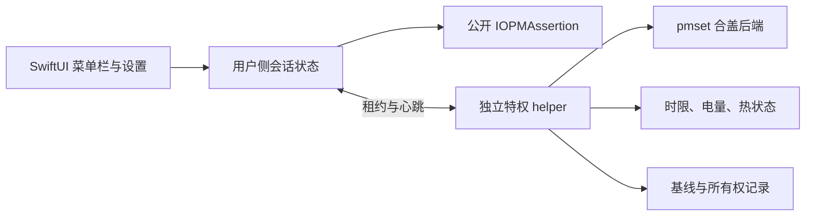

# 技术设计草案

状态：2026-10-09 已实现开发预览；Linux 纯逻辑已测试，Mac 构建与真机行为分别验证。

## 分层

暂定采用 SwiftUI MenuBarExtra + 必要的 AppKit 集成。普通保活使用公开断言；合盖保活候选为 helper 中调用系统 pmset。内部 IOKit 合盖接口仅保留研究入口。

## 状态模型

用户侧至少区分：关闭、需要授权、启用中、运行中、停止中、保护停止、错误／状态未知。helper 未确认生效时，UI 不能先显示运行成功。未知电量、热状态或网络状态应明确展示未知。

“已恢复设置”和“机器已睡眠”是不同结果。其他断言、外接显示器及系统策略可能保持机器运行，UI 不保证即时入睡。

## Helper 与权限

- 用户 UI 和任何未来任务均不以 root 运行。
- helper 只提供获取状态、取得／续期／释放租约、查询恢复结果等固定操作。
- 不接受 shell 文本、任意可执行路径或任意 pmset 参数。
- 生产 XPC 服务校验客户端代码身份和允许的 bundle identifier；安装产物与记录由 root 持有。
- CLI 不作为产品入口。诊断与授权通过 App 完成。
- 以 SMAppService 注册内嵌 LaunchDaemon 为优先候选；其批准步骤、部署目标和安装位置需 Mac 验证。签名安装包作为备选。
- 不依赖手工添加宽泛 sudoers 权限，也不关闭 SIP。

## 租约与恢复

1. 开始前检查供电、电量、热状态及现有系统设置。
2. 如发现其他工具已开启 SleepDisabled，拒绝接管并说明冲突。基线为未知时拒绝修改。
3. helper 先持久化基线和改动意图，再执行候选操作；读取实际状态确认成功。
4. 租约具有硬时限。候选心跳间隔为 5 秒，失联阈值为 15～30 秒；具体数值待验证。
5. UI 失联、租约到期、退出或保护条件触发时，helper 撤销本应用租约并恢复所拥有的设置。
6. helper 由 launchd 管理；崩溃重启或系统重启时先根据记录修复遗留状态，不自动重新保活。
7. 恢复失败保留记录并返回错误，不能删除证据后假装已恢复。

内部协议可支持多个租约，MVP UI 仅需一个手动定时会话。最后一个有效租约结束才恢复，避免未来任务绑定产生互相覆盖。

PID 不能独立作为租约身份，应结合随机令牌、客户端身份与进程生命周期；时间策略需要处理休眠、时钟变化和重启。硬截止与心跳到期分开存储，恢复启动不沿用失效心跳。

## 电源、热状态与失败策略

监控 IOPowerSources 的供电变化和电池信息，以及 ProcessInfo 的热状态。helper 自身实施保护，不能只依赖 UI。

普通保活、合盖就绪、供电变化后重新验证分别处理。合盖前取得租约；不要等待合盖通知再启用。保护停止后不因仍然有任务而自动重启；恢复需要明确状态转换和回滞。

热状态不是精确温度，也不能证明机身通风。读取连续失败的策略需要保守默认。首版先恢复设置和释放本应用断言；是否在临界情况下强制调用 sleepnow 是待决策项，需解释其对其他任务的影响并真机验证。

## 网络

网络路径状态可先用 Network.framework 监测。DNS／HTTPS 探测为可选诊断，需限制频率，区分 VPN、代理、无默认路由和目标服务错误。网络请求成功不是任务进度证明。MVP 不接管任务重试。

## 分发与生命周期

目标是用户下载后可正常安装的签名、公证发行物。暂定首版 macOS 14+ 与 Apple Silicon 优先，是否加入 Intel 取决于验证矩阵。

需要覆盖 helper 注册失败、App 移动路径、升级中版本不匹配、退出、强杀、重启及卸载。提供图形化“停止并移除后台组件”入口，先确认恢复再卸载；单纯把 App 拖进废纸篓不能作为可靠恢复方案。

当前源码目录为 app/、core/、helper/、shared/、tests/；Swift Package 按平台加入 macOS 目标。构建配置见 docs/distribution.md。

## 当前实现细节与约束

首版使用单个手动租约，令牌 UUID 与 XPC 连接 owner UUID 绑定，不支持新连接接管旧租约。心跳每 5 秒、失联 20 秒、helper 每 2 秒巡检；硬截止使用包含休眠时间的 mach_continuous_time，并用墙钟偏差检测超过 60 秒的跳变。每次续期先检查旧会话是否已过期。

严重热状态持续 30 秒或临界热状态立即停止。未知供电／热状态、在电池上电量未知时停止。接电时没有电池读数允许运行，适用于无电池机器；物理合盖支持仍需单独验证。保护停止只恢复设置，不强制 sleepnow。

恢复记录通过无跟随链接、0700 目录、0600 文件、原子 rename 与 fsync 持久化。基线只接受明确 false；已有 true 视为冲突，未知拒绝修改。写意图后失败会立即恢复；恢复失败保留记录并重试。

XPC 在 resume 前设置 NSXPCConnection 的签名要求。构建时将 App 的稳定证书 designated requirement 固定到 helper 签名的 __info_plist；App 校验内嵌 helper 的 designated requirement。ad-hoc 构建只开放普通模式。协议只接受固定操作、版本、有限时长、保护策略和租约令牌，不接收路径或命令。

launchd KeepAlive 不能覆盖用户删除 App、后台权限撤销或服务被管理员卸载。系统全局开关也不能区分其他工具中途写入相同值。当前提供退出、恢复与先恢复后注销入口，升级需先注销旧组件；不是已验证的自动升级方案。
